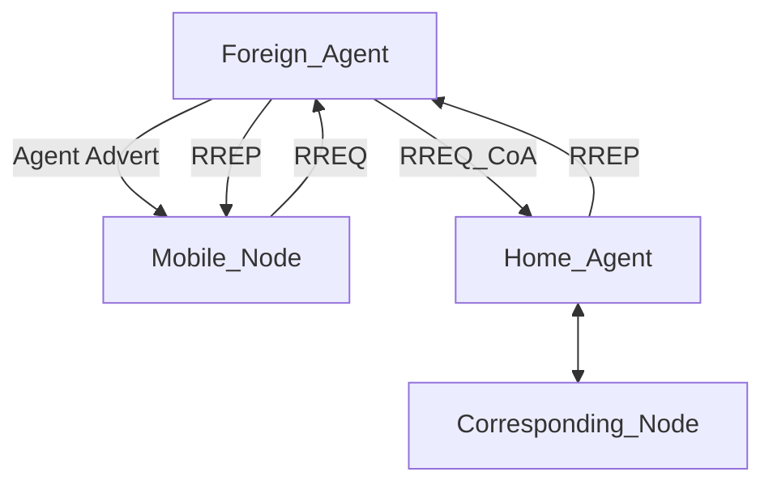

# mip
Mobile IP implementation for Linux in C

implementation of Mobile IP RFC 5944 for Linux, written in C.

# Install
git clone https://github.com/juakali-networks/mip.git

<pre>cd /mip/src</pre>

<pre>make clean</pre>

<pre>make</pre>

# Overview
Mobile IP is a communication protocol (created by extending Internet Protocol, IP) that allows the users to move from one network to another with the same IP address. It ensures that the communication will continue without the user’s sessions or connections being dropped. 

Using Mobile IP, a mobile node is able to roam from an its home network to any foreign network while being always reachable through its home IP address.

THis is a partial implemntation of RFC 5944 specification. In case you are interested inthe full implementation, please contact us on juakali.networks@gmail.com

Basic use came be demonstrated using the diagram below.

# Usage
Three Virtual machines (VMs) or PCs

VM_1, VM_2 and VM_3.

Run the commands on the VMs in the following order

On VM_1 (Foreign Agent)
<pre>cd /mip/src</pre>

<pre>sudo ./mip -m </pre>

Foreign Agent sends multicast agent advertisement packet

On VM_2 (Mobile Node)
<pre>cd /mip/src</pre>

<pre>sudo ./mip -r </pre>

Mobile Node sends Registration Request (RREQ) packet to Foreign Agent, on receieving the Agent Advertisement packet

On VM_1 (Foreign Agent)
<pre>cd /mip/src</pre>

<pre>sudo ./mip -n </pre>

Foreign Agent sends RREQ packet with care of Address to Home Agent on receiving the RREQ packet from Mobile Node

On VM_3 (Home Agent)
<pre>cd /mip/src</pre>

<pre>sudo ./mip -q </pre>

Home Agent sends Registration Reply (RREP) packet back to Foreign Agent on receiving the RREQ packet

On VM_1 (Foreign Agent)
<pre>cd /mip/src</pre>

<pre>sudo ./mip -j </pre>

Foreign Agent Forwards RREP packet to Mobile Node on receiving the RREP packet from MoHome Agent

If you have questions, comments or need any additional support, contact juakali.networks@gmail.com

